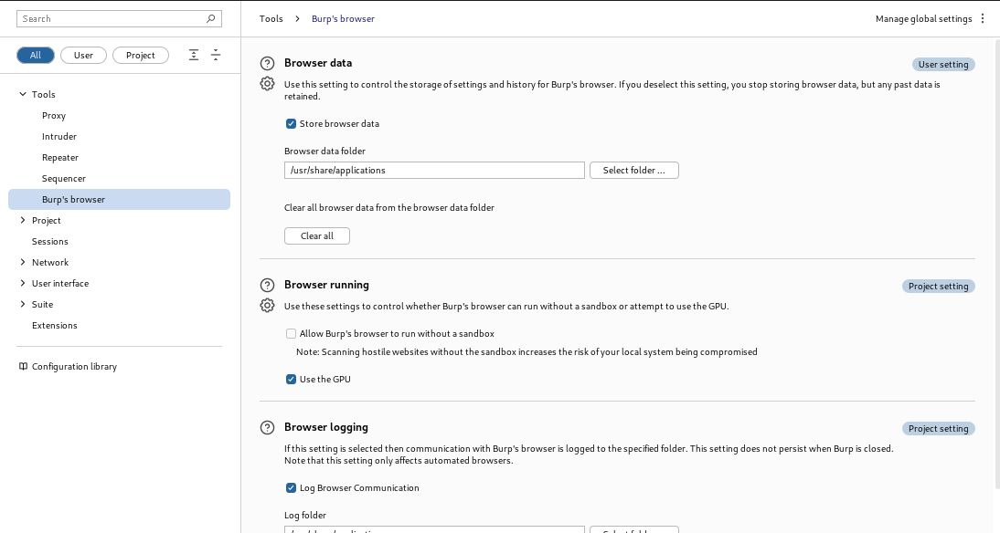

# Error-Solutions
 A repository for sharing solutions to errors encountered in various software.

# Solution: Opening Firefox Instead of Chromium in Burp Suite's Embedded Browser in Kali Linux

## Overview

In Burp Suite, the default embedded browser is Chromium. However, if you prefer to use Firefox instead, you can modify it in burpsuite also to achieve this. This solution provides step-by-step instructions on how to open Firefox instead of Chromium in Burp Suite's embedded browser on Kali Linux.

## Prerequisites

- Kali Linux installed on your system
- Burp Suite Community Edition is preinstalled on kali linux.

## Steps

### 1. Open Files in Kali Linux.

 - Search for firefox.
 - Click on "Search everywhere".
 - Now you can see a "firefox-esr.desktop".
 - Right click on it.
 - Click on "Open item location".
 - Now click on three dots and copy the location.

### 2. Open the Burp Suite.

- Open Settings.
- Click on "Burp's browser".
- Click on select folder and paste that path you have copied in 1st Step.

It will look like this:
 
 